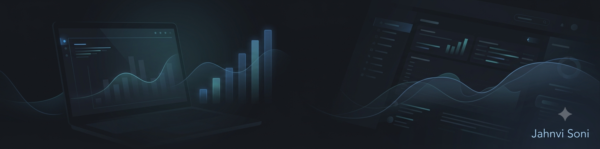

  

# Hi, I'm Jahnvi Soni 👋

 

## 🎓 About Me

I'm a Commerce graduate — **B.Com (Hons)** from Jesus and Mary College, University of Delhi — currently pursuing my **M.Com** from the Department of Commerce, University of Delhi. Along the way, I realized that the parts of Commerce I enjoyed most — research, patterns in numbers, understanding *why* something happens — are exactly what data and business analytics is about. That's what's pulling me from a Commerce background into an **analytics career**, building on research and business fundamentals rather than starting from scratch.

 

## 🔭 Currently Learning

 

## 🛠️ Tools & Tech

| Category | Tools |
|---|---|
| **Data Analysis** | Python, SQL, Statistics, Machine Learning Fundamentals |
| **Visualization** | Power BI, Excel (Pivot Tables, VLOOKUP, SUMIF) |
| **Foundations** | Financial Analysis, Business Research, Market Research |

 

## 📊 Projects & Case Studies

### 📈 Research Dissertation — Financial Influencers & Young Investors
**Problem:** Financial influencer content shapes how young investors act, but the real impact wasn't well understood.
**Approach:** Designed and ran a primary research survey across 193 respondents in Delhi NCR, covering financial literacy, behavioural biases, and investment patterns.
**Tools:** Survey methodology, statistical analysis.

### 📊 Hospital ER Dashboard — Power BI
**Problem:** Hospital emergency room data needed to be turned into an at-a-glance operational view.
**Approach:** Built an interactive dashboard tracking patient admissions, average wait times, department referrals, and demographics.
**Tools:** Power BI.

### 🧴 Marketing Campaign Plan — Elegant Beauty Foundation
**Problem:** A new skincare foundation product needed a full go-to-market strategy.
**Approach:** Built a complete 7Ps marketing mix plan — product positioning, pricing, distribution, and promotion — as a 3-person group project.
**Tools:** Market research, marketing mix framework.

### 🏢 Corporate Ethics & CSR Case Study — Microsoft Corporation
**Problem:** Understanding how a large corporation embeds ethics and social responsibility into real operations, not just policy documents.
**Approach:** Researched and analyzed Microsoft's governance framework, code of ethics, and CSR initiatives across sustainability, DEI, and digital inclusion.
**Tools:** Corporate research, case analysis.

 

## 📈 GitHub Stats

 

## 🎯 Open To

💼 Internships and entry-level roles as a **Data Analyst** / **Business Analyst**

 

## 🌐 Connect With Me

🔗 **LinkedIn:** [linkedin.com/in/jahnvi-soni-a4706531a](https://linkedin.com/in/jahnvi-soni-a4706531a)
📧 **Email:** [sonijahnvi437@gmail.com](mailto:sonijahnvi437@gmail.com)
📄 **Resume:** [View / Download PDF](./assets/Jahnvi_Soni_Resume.pdf)
